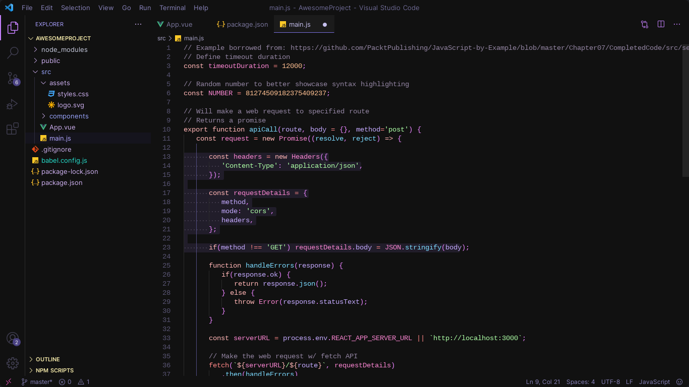

# Cosmic Iris

Cosmic Iris theme is a visually stunning and vibrant theme for Visual Studio Code that aims to enhance your coding experience with its cosmic-inspired color palette and modern design. This theme is designed to be visually appealing while maintaining readability and minimizing eye strain during long coding sessions.

## Features

- **Cosmic Palette:** The Cosmic Iris features a carefully curated color palette inspired by the mysteries of the cosmos, combining deep blues, vibrant purples, and celestial accents.
- **Readability:** The theme ensures a balance between the cosmic aesthetics and readability. The carefully chosen colors provide clear contrast between different elements, making your code easy to read and understand.
- **Syntax Highlighting:** Cosmic VSCode Theme offers syntax highlighting for a wide range of programming languages, allowing you to focus on your code while enjoying a visually pleasing environment.
- **UI Consistency:** The theme not only provides syntax highlighting but also extends its aesthetic to the entire Visual Studio Code UI, including the sidebar, activity bar, and various panels, offering a cohesive and immersive experience.
- **Customization:** While Cosmic VIris comes with a stunning default configuration, it also provides customization options to adapt the theme to your personal preferences. You can tweak the theme's settings or easily switch between light and dark variants.

## Installation

1. Launch Visual Studio Code.
2. Open the Extensions view by clicking on the square icon on the left sidebar or pressing `Ctrl+Shift+X`.
3. Search for "Cosmic Iris" in the Extensions marketplace.
4. Click on the "Install" button next to the theme.
5. Once installed, click on the gear icon to the right of the "Install" button and select "Reload" to activate the theme.
6. Go to `File > Preferences > Color Theme` (or press `Ctrl+K Ctrl+T`) and select "Cosmic" as your active theme.

## Acknowledgments

The Cosmic Iris theme was created with inspiration from the beauty of the universe.

## Contact
If you encounter any issues or have suggestions for improvements, please feel free to [open an issue] on the GitHub repository for this theme.
Contributions are welcome! If you would like to contribute to the development of Cosmic VSCode Theme, please submit a pull request with your proposed changes.

If you have any questions, feedback, or suggestions regarding the Cosmic VSCode Theme, I would love to hear from you. Feel free to reach out to me [here].

[here]: https://shravaninikam.carrd.co/
[open an issue]: https://github.com/shravaninikam/Cosmic-Iris

Enjoy your coding experience with Cosmic Iris Theme! If you find it useful and aesthetic, please consider sharing it with your friends and colleagues. Happy coding!
